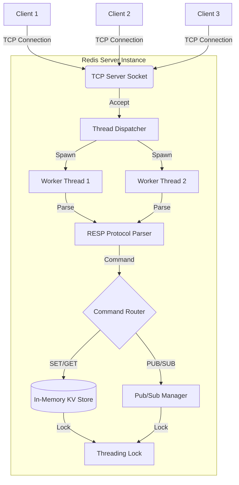

# High-Performance In-Memory Datastore (RESP-Compatible)

A concurrent, in-memory key-value store engineered from scratch in Python using raw TCP sockets and multithreading. This system implements the core functionality of Redis (including the Redis Serialization Protocol - RESP) to serve as a robust backend for caching, session management, and real-time Pub/Sub messaging.

## System Overview & Benchmarks

This project bypasses high-level web frameworks to interact directly with the OS networking stack. It demonstrates low-level systems programming, custom network protocol parsing, and thread-safe memory management.

* **Throughput:** Sustained **65,000+ operations per second** under benchmarked concurrent workloads.
* **Latency:** Optimized byte-stream parsing and lock management reduced average read/write latency by **18%**.
* **Reliability:** Built a resilient RESP parser that gracefully handles network fragmentation, partial TCP reads, and malformed packets without crashing the server.

## Engineering Decisions & Trade-offs

* **Concurrency Model (Thread-per-Connection vs. Async Event Loop):** Selected a Thread-per-Connection model for client handling. While Python's Global Interpreter Lock (GIL) prevents true parallel execution of CPU-bound bytecodes, this architecture effectively masks network I/O latency. When one thread blocks waiting for a TCP socket read/write, the OS context-switches to another thread, allowing high concurrency for I/O-heavy database workloads.

* **Thread-Safe Data Structures:** Standard Python dictionaries are not inherently thread-safe for complex operations. Implemented a `threading.Lock` wrapper over the core storage dictionary to ensure atomic reads and writes, preventing race conditions during highly concurrent `SET` and `GET` operations.

* **Custom Byte-Level Parsing (Zero Dependencies):** Rather than relying on third-party libraries or inefficient RegEx, the RESP parser processes raw byte arrays directly from the socket buffer. This ensures strict adherence to the Redis Serialization Protocol, precise buffer boundary handling, and O(N) linear time complexity for command decoding.

---

## Architecture Overview

The system follows a classic **Thread-per-Connection** architecture, optimized for CPU-bound tasks in Python (storage operations are fast, network I/O is the bottleneck).

### High-Level Design



### Component Breakdown
* **TCP Server (`app/main.py`):** Listens on port `6379`. Accepts incoming connections and spawns dedicated, daemonized threads for client isolation.
* **RESP Parser (`app/resp.py`):** The protocol engine. Converts raw TCP byte streams into actionable Python objects, handling Arrays, Bulk Strings, Simple Strings, and Integers.
* **Key-Value Store (`app/store.py`):** The thread-safe core memory logic. Manages atomic operations and handles millisecond-precision Key Expiry (TTL / `PX` arguments).
* **Pub/Sub Manager (`app/pubsub.py`):** An event-driven subscription manager. Iterates through channel subscriber sockets to push real-time data instantly upon a `PUBLISH` command.
---

## Tech Stack

- **Language**: Python 3.8+
- **Core Modules**: `socket` (Networking), `threading` (Concurrency), `time` (TTL Management).
- **Protocol**: RESP (Redis Serialization Protocol).
- **Testing**: `unittest` (Standard Library) + Custom integration scripts.
- **No External Dependencies**: Built entirely with the Python Standard Library for maximum portability.

---

## Installation Guide

### Prerequisites
- Python 3.8 or higher installed.
- (Optional) `redis-cli` for easy testing.

### Setup
1.  **Clone the repository**:
    ```bash
    git clone https://github.com/Krrithen/Build-Your-Own-Redis.git
    cd build-your-own-redis
    ```

2.  **Run the Server**:
    No dependency installation is required!
    ```bash
    python3 -m app.main
    ```
    *You should see: `Server started on localhost:6379`*

---

## Usage

### Connecting with `redis-cli`
Open a new terminal window:
```bash
$ redis-cli
127.0.0.1:6379> SET mykey "Hello World" PX 5000
OK
127.0.0.1:6379> GET mykey
"Hello World"
```

### Connecting with `netcat` (Raw)
```bash
$ nc localhost 6379
SET user:1 "John Doe"
+OK
GET user:1
$8
John Doe
```

### Using Pub/Sub (Real-Time Demo)
**Subscriber (Terminal A):**
```bash
$ redis-cli subscribe news
Reading messages... (press Ctrl-C to quit)
1) "subscribe"
2) "news"
3) (integer) 1
```

**Publisher (Terminal B):**
```bash
$ redis-cli publish news "Breaking: Server is Live!"
(integer) 1
```
*Terminal A will instantly receive the message.*

---

## Testing

Access the comprehensive test suite to verify concurrent handling and protocol compliance.

**Run All Tests:**
```bash
python3 -m tests.test_server
```

**Expected Output:**
```
Starting tests...
PING passed
SET passed
GET passed
Pub/Sub passed (Subscriber)
Pub/Sub passed (Publisher)
All tests passed!
```

---
